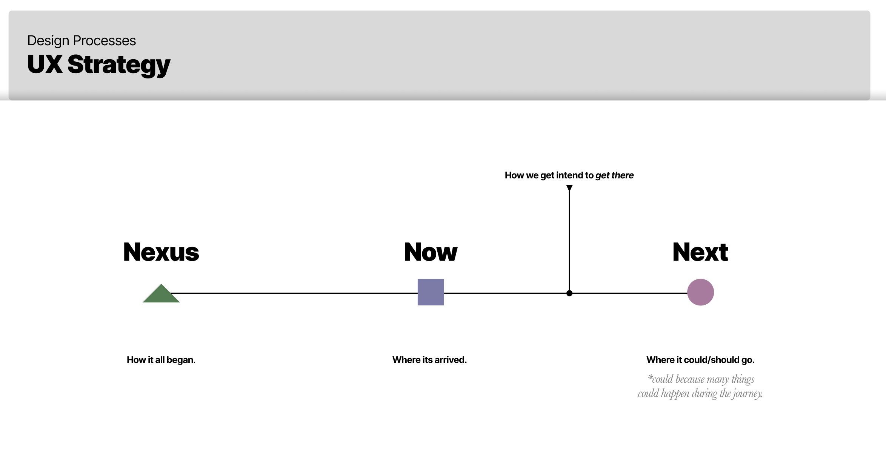
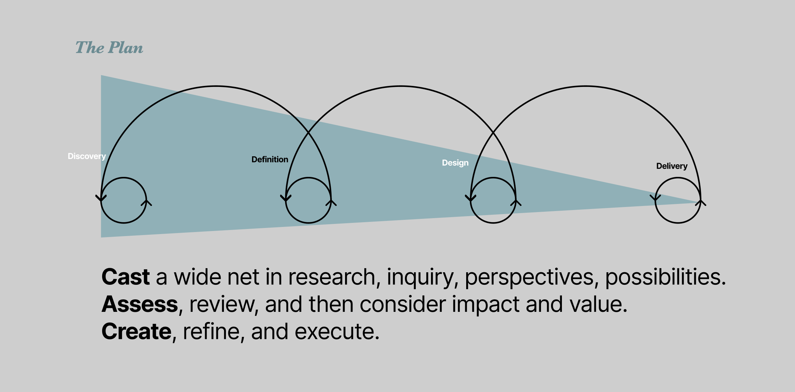

By considering the variety of **perspectives (time, person, level, stage)**, one can better prepare for needs and possibilities of a journey (a user's journey, a designer's journey, a company's journey).

